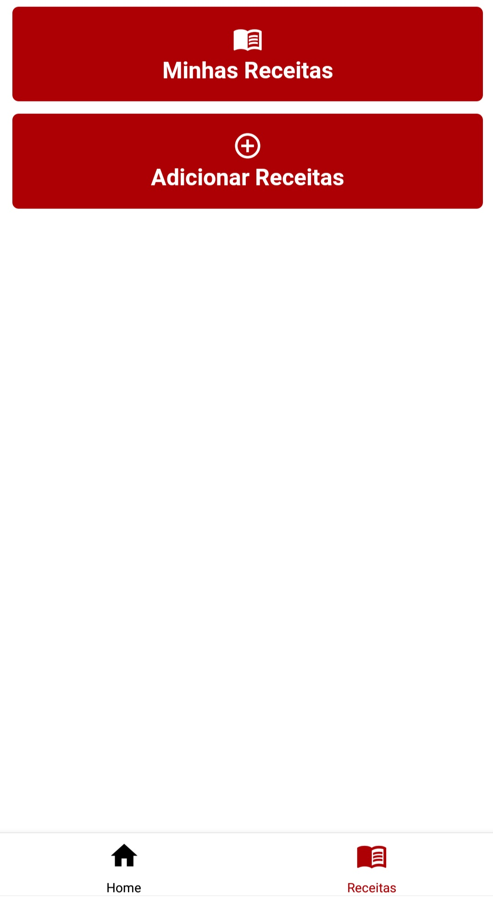
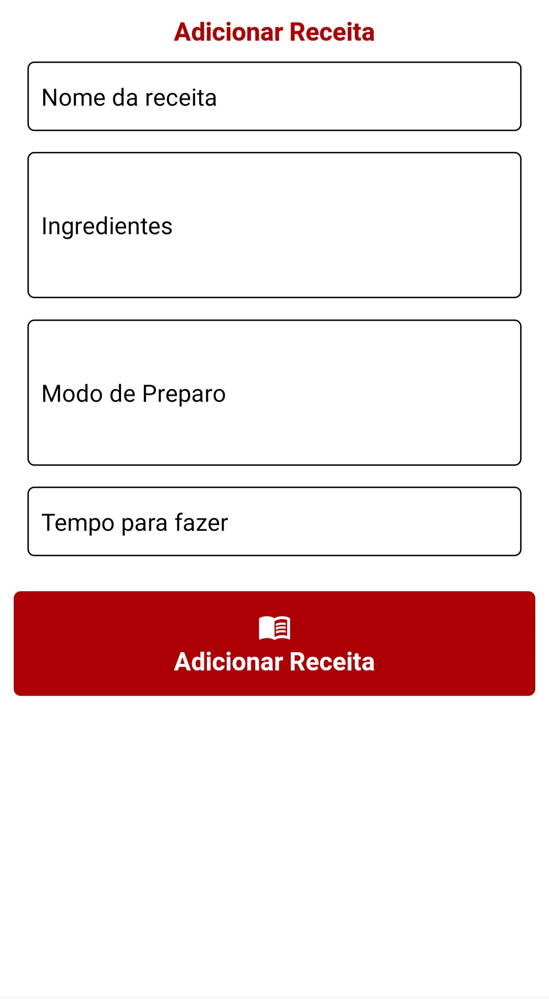
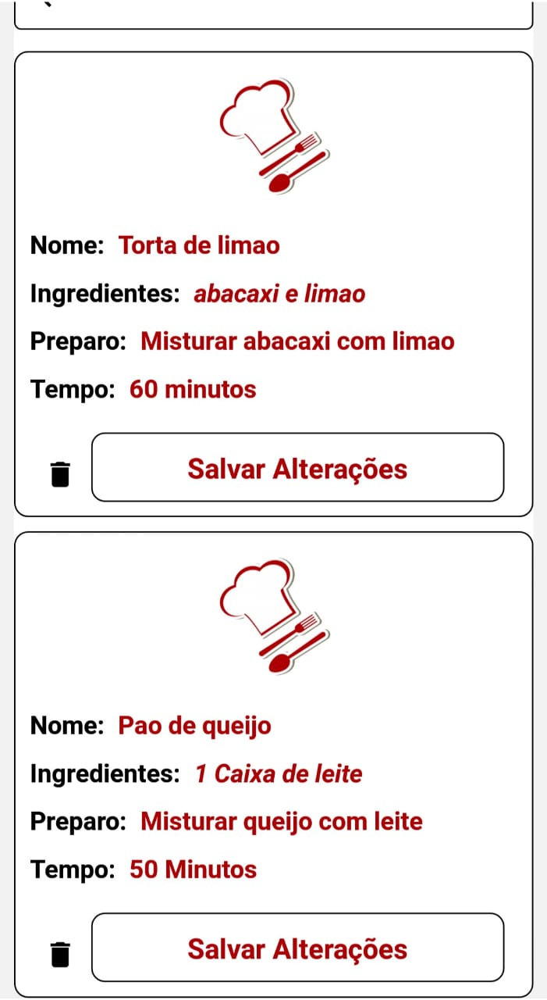

<h1 flexdirection='row'>
    
    
    
    
</h1>

# Indice

- Sobre o projeto.
- Tecnologias utilizadas.
- Dependencias do projeto.

### 📖Sobre

O <b>Projeto</b> foi criando com intenção de você armazenar suas receitas <b>virtualmente</b>.

### 🚀Tecnologias utilizadas

O Projeto foi desenvolvido utilizando as seguintes <b>tecnologias</b>

- [Expo](https://docs.expo.io/)
- [Styled-Components](https://styled-components.com/)
- [FireBase](https://firebase.google.com/)

## 📁 Dependencias

```bash
# Aqui você ira instalar o sistema de firebase.

expo install firebase 

# Aqui você ira instalar a parte estilização

expo install styled-components

```


